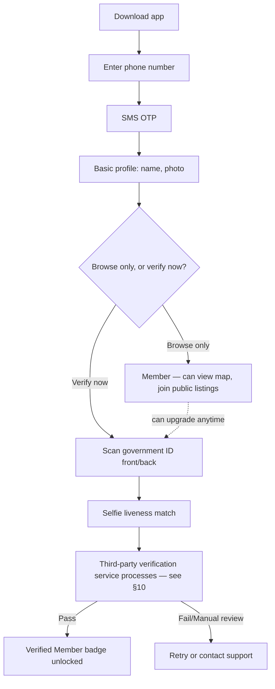
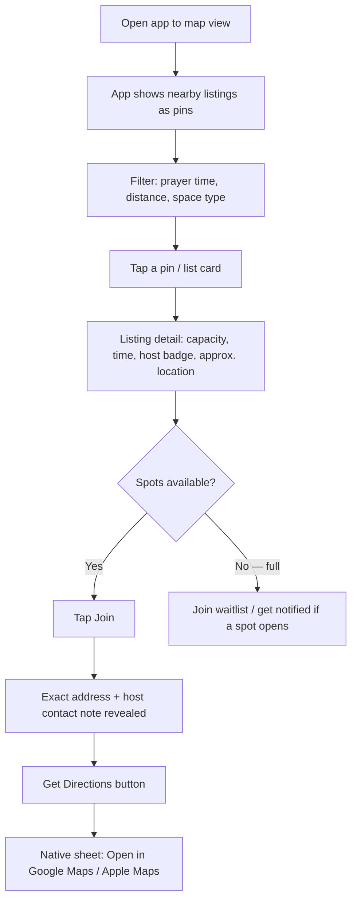
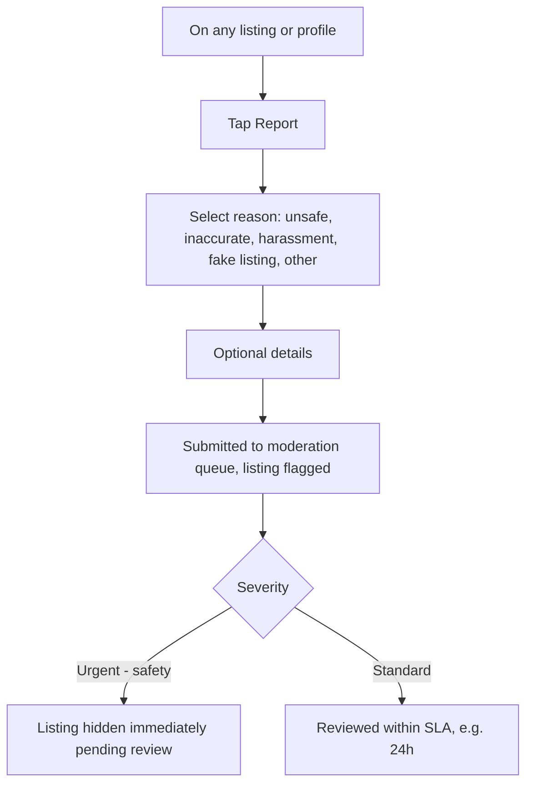

# Jamah Finder — Product & Technical Specification

*A community app for finding and hosting congregational prayer (jamah). Prepared as a hand-off document for a development team.*

---

## 1. Overview

Jamah Finder helps Muslims find people to pray jamah (congregational prayer) with, and helps hosts — mosques, musallas, offices, or individuals — offer up a space and a time. The core loop is simple:

- A **Host** lists a space: how many people it fits, which prayer(s) it's open for, and where it is.
- A **Seeker** browses a map, finds a jamah happening near them at the right time, and joins.
- Because this involves meeting people in person and sharing your location, **trust and safety are the product**, not an add-on. Verification, moderation, and clear safety defaults matter as much as the map.

This doc covers product scope, user flows, data model, the verification system, map/directions integration (including current Google Maps Platform pricing), tech stack options, and an MVP roadmap. A companion set of screen mockups is provided alongside this doc.

---

## 2. Goals & Non-Goals

**Goals**
- Make it fast to find a jamah happening in the next hour, nearby.
- Make listing a space low-friction for mosques/musallas, and appropriately higher-friction for individuals offering private space.
- Build trust quickly for a young, mobile-first audience — should feel like a well-made consumer app, not a dated "community board."
- Keep people safe: verified identities, reportable listings, sensible defaults about what's shared with whom and when.

**Non-goals (for v1)**
- Not a general mosque-finder/business directory (that's a solved problem — e.g. Muslim Pro, Salatomatic). Jamah Finder is about *live, joinable* prayer sessions and spaces, not a static POI list.
- Not a social network or messaging app. Keep in-app contact minimal and purpose-built (see §10).
- Not handling donations/payments in v1.

---

## 3. Target Users

| Persona | Description | Primary need |
|---|---|---|
| **The Commuter Seeker** | Young professional/student, prays away from home/mosque, e.g. between meetings or classes | "Is there a jamah near my office in the next 20 minutes?" |
| **The Institutional Host** | Admin for a mosque, musalla, university prayer room, or company prayer room | List recurring prayer times/capacity once, keep it accurate with minimal upkeep |
| **The Individual Host** | Someone offering a spare room, office, or common space occasionally | Offer space for a one-off or recurring jamah, feel safe doing so |

---

## 4. Feature Set

### MVP (Phase 1)
1. Onboarding with phone/email verification
2. Optional-but-incentivized ID verification for a "Verified" badge (required before hosting a *personal* space, or joining one)
3. Map + list view of nearby jamah listings, filterable by prayer (Fajr/Dhuhr/Asr/Maghrib/Isha), distance, and space type
4. Listing detail page: capacity, address (approximate until joined), host badge, prayer time, photos, rules
5. "Suggest a space" flow for hosts (institution or individual)
6. Join / RSVP flow with live spot count
7. "Get Directions" → native picker for Google Maps or Apple Maps
8. Report/flag a listing or user
9. Manual moderation queue — new listings go live only after light review

### Phase 2
- Recurring listings & auto-renewing weekly schedules
- Ratings & prayer-count history ("hosted 40 jamahs")
- Push notifications ("Dhuhr jamah starting in 15 min, 0.3 mi away")
- Institutional partnerships (mosques get a verified organization badge without individual ID checks for the space itself)
- In-app check-in ("I'm here") for lightweight safety confirmation
- Gender-specific space indicators (separate brothers'/sisters' space, family-friendly, wheelchair accessible)
- Hijri calendar + accurate prayer-time calculation by location (multiple calculation methods/madhabs)

### Explicitly out of scope for v1
- In-app chat/DM (route contact through the app's structured flow only, not open messaging, to reduce grooming/harassment surface)
- Payments/donations

---

## 5. User Roles

- **Guest** — can browse the map, cannot see exact addresses or join.
- **Member** — phone/email verified. Can join public/institutional listings, cannot host a personal-space listing.
- **Verified Member** — ID verified. Can host any listing type and join personal-space listings.
- **Institution** — a mosque/musalla/organization account, verified via public registry or manual document check, can post under an org badge.
- **Moderator/Admin** — internal role for reviewing new listings and reports.

A simple rule worth building the whole trust system around: **the more private the space, the higher the trust bar to host or join it.** Public institutional spaces (mosque, musalla, office lobby) need lighter verification than someone's private home.

---

## 6. User Flows

### 6.1 Onboarding & Verification



### 6.2 Discover & Join a Jamah



### 6.3 Suggest a New Space

```mermaid
flowchart TD
    A[Tap + Suggest a space] --> B{Space type?}
    B -->|Institution| C[Search/claim existing org or add new — light verification]
    B -->|Personal| D[Requires Verified Member status first]
    D -->|Not verified| E[Prompt to complete ID verification]
    C --> F[Enter details]
    D -->|Verified| F
    F --> G[Address — pin drop on map]
    F --> H[Capacity / number of spaces]
    F --> I[Prayer time(s) offered, one-off or recurring]
    F --> J[Photos + notes: e.g. parking, entrance, women's area]
    G & H & I & J --> K[Submit for review]
    K --> L[Moderation queue — auto-checks + human review]
    L -->|Approved| M[Listing goes live]
    L -->|Rejected/changes requested| N[Host notified with reason]
```

### 6.4 Reporting & Safety



---

## 7. Screen List (maps to the companion mockups)

1. **Verify Your Identity** — onboarding step showing the 3-step verification (phone → ID → selfie) and what the "Verified" badge unlocks.
2. **Home / Map View** — map with pins, bottom sheet of nearby listings, filter chips, search.
3. **Listing Detail** — photo, host badge, capacity meter, prayer time, Join button, reviews.
4. **Suggest a Space** — form flow for hosts (institution vs. personal toggle).
5. **Directions Chooser** — modal sheet: "Open in Google Maps" / "Open in Apple Maps."

---

## 8. Data Model (high level)

**User**
- id, name, photo, phone (verified bool), email (verified bool)
- verification_status: `unverified | id_verified | institution`
- verification_provider_ref (opaque token from KYC vendor — never store raw ID images, see §10)
- trust_score / prayers_hosted / prayers_joined counts
- home_location (optional, for "near me" search)

**Listing (Space)**
- id, owner_id (User or Institution)
- type: `institution | personal`
- title, description, photos[]
- address (full — only shown to joined members), approximate_geo (shown publicly, e.g. rounded to ~150m or a landmark)
- capacity_total, capacity_open
- prayers_offered[]: { salah: Fajr/Dhuhr/Asr/Maghrib/Isha, time or "calculated", recurring: bool, days[] }
- amenities: parking, wudu area, women's section, wheelchair accessible
- status: `pending_review | live | rejected | paused`
- rating_avg, rating_count

**JamahSession** (a specific instance/date of a listing, if not purely recurring)
- id, listing_id, date, prayer, spots_open, attendees[]

**Attendance/Join**
- id, session_id, user_id, joined_at, status (`going | waitlisted | cancelled`)

**Report**
- id, target_type (listing/user), target_id, reporter_id, reason, details, status, resolved_by, resolved_at

**Institution**
- id, name, registration/verification evidence, admin_user_ids[], badge_type

---

## 9. Verification & Safety System

This is the part worth the most design attention, since the app's core promise is *"you can trust the person/place on the other end."*

### 9.1 Identity verification — don't build this yourselves
Scanning, storing, and matching government IDs carries serious legal and security liability (data breach risk, state ID-scanning laws, PII regulations). The strong recommendation is to **use a specialized identity-verification vendor** rather than building an in-house pipeline. Well-established options:

- **Stripe Identity**
- **Persona**
- **Onfido**
- **Veriff**

These typically work the same way: your app hands the user off to the vendor's SDK, the vendor captures and verifies the ID + a selfie liveness check, and returns your backend a simple result (`verified` / `failed` / `needs_review`) plus a reference token — **your servers never touch or store the raw ID image**. This meaningfully reduces your compliance burden and is the standard approach for apps with this kind of trust requirement (rideshare, dating, marketplace apps all do this).

### 9.2 Tiered trust model
- **Unverified** — browse only.
- **Phone/email verified** — can join institutional/public listings.
- **ID verified** — can host any listing, can join personal/private listings, gets a visible badge (see mockups for the badge mark).
- **Institution** — verified at the organization level (e.g., confirming a mosque is a real, registered entity), rather than requiring every congregant to individually ID-verify to attend.

### 9.3 Space-type safety defaults
- **Institutional listings** (mosque, musalla, office prayer room, university room): lower friction, since these are semi-public spaces with existing accountability.
- **Personal listings** (someone's home, apartment, dorm): higher bar —
  - Host must be ID verified.
  - Encourage first-time meetups in a common area (lobby, living room visible from entrance) rather than a private room, and surface this as guidance in the app, not just fine print.
  - Cap initial capacity/visibility for new personal hosts until they've had a few successful sessions (a light "reputation ramp").
  - Exact address only revealed after a user taps **Join** (not before), and never to Guests.

### 9.4 Moderation
- Every new listing enters a review queue before going live — automated checks (address is plausible, photos aren't flagged, no duplicate spam) plus a light human pass, especially for personal listings.
- Reports on safety grounds hide the listing immediately pending review, rather than waiting on the standard SLA.
- Block/report available from every profile and listing.

### 9.5 Location privacy
- Don't show exact coordinates on the public map for personal listings — show a fuzzed radius or nearest landmark, and reveal the precise pin only after someone joins.
- Institutional listings (mosques etc.) can show exact location, since that's already public information.

---

## 10. Map & Directions Integration

### 10.1 Displaying the map in-app
Google Maps is a solid default, but it is **not fully free** — worth knowing before committing. As of the March 2025 pricing restructure, Google replaced the old $200/month blanket credit with **per-SKU free monthly usage caps**. For the pieces you'd actually use:

- **Maps SDK for Android/iOS** (the interactive in-app map view): unlimited free usage.
- **Dynamic Maps / map loads**: 10,000 free loads/month, then billed per 1,000 loads beyond that.
- **Geocoding, Places Autocomplete, etc.**: separate SKUs, each with their own free monthly cap (generally in the low thousands), then metered.

Practically: for an MVP with modest traffic, you'll likely stay within free tiers for a while, but you should set a Google Cloud budget alert from day one so a usage spike doesn't produce a surprise bill. **Mapbox** is a reasonable alternative with its own generous free tier and a design-forward map style out of the box, worth a developer comparing against Google before locking in.

### 10.2 "Open in Google Maps or Apple Maps" popup
Good news — this part genuinely doesn't need any paid API. It's just deep-linking into whichever app is installed, using standard URL schemes:

- **Apple Maps**: `https://maps.apple.com/?daddr=<lat>,<lng>` (or `maps://` scheme)
- **Google Maps**: `https://www.google.com/maps/dir/?api=1&destination=<lat>,<lng>` (universal link, works whether or not the Google Maps app is installed — falls back to web) or `comgooglemaps://` if you want to force the native app when present

The recommended pattern: tap **Get Directions** → show a small action sheet with two buttons ("Open in Apple Maps" / "Open in Google Maps") → launch the corresponding URL. On Android, default to Google Maps only (Apple Maps doesn't exist there); on iOS, show both since users are split. This is exactly what the "Directions Chooser" mockup shows.

---

## 11. Recommended Tech Stack

| Layer | Recommendation | Notes |
|---|---|---|
| Mobile app | React Native or Flutter | One codebase for iOS + Android; both have solid map libraries (`react-native-maps`, `google_maps_flutter`) |
| Backend | Node.js/TypeScript or Supabase (Postgres + auth + storage managed) | Supabase is a fast way to get a real backend without building auth/storage from scratch |
| Database | PostgreSQL (with PostGIS extension) | PostGIS makes "find listings within X miles" queries simple and fast |
| Identity verification | Stripe Identity / Persona / Onfido (pick one, see §9.1) | Don't build this in-house |
| Maps | Google Maps Platform or Mapbox | See §10.1 for pricing caveats |
| Push notifications | Firebase Cloud Messaging | Cross-platform, free |
| Hosting | Supabase/Firebase for MVP; AWS/GCP if you outgrow it | Keep MVP infra simple and managed |
| Moderation tooling | Lightweight internal admin dashboard (could be a simple Retool/internal React app) | You'll need this from day one, not later |

---

## 12. Non-Functional Requirements

- **Accessibility**: standard mobile accessibility (VoiceOver/TalkBack support, sufficient contrast, tap target sizes ≥44px).
- **Localization**: Arabic RTL support should be planned for from the start, even if English ships first — retrofitting RTL later is expensive. Also consider Urdu, French, Indonesian depending on target markets.
- **Prayer time accuracy**: if you calculate prayer times (rather than only using host-entered times), support multiple calculation methods (ISNA, MWL, Umm al-Qura, etc.) since users disagree on this by region/school of thought — make it a setting, not a hardcoded default.
- **Performance**: map should feel instant — cluster pins at low zoom, paginate/virtualize listing lists.
- **Offline/poor connectivity**: cache the last-loaded map view and listings so the app isn't blank on a bad connection (relevant for people praying in basements/parking structures with weak signal).

---

## 13. Design Direction

The companion mockup file shows the visual direction: a warm, modern palette (deep ink navy, warm amber accent, soft sand background) rather than the literal green-and-gold-dome look many prayer apps default to — the goal is something that reads as a well-made consumer app a younger audience would trust and enjoy using, with trust/verification cues (badges, a simple geometric star mark) woven into the UI rather than bolted on as a separate "legal" screen.

---

## 14. Success Metrics

- **Activation**: % of new users who complete verification within 7 days
- **Liquidity**: median time-to-join (how long between opening the app and joining a listing)
- **Supply health**: number of active listings per city, % of listings that are recurring vs. one-off
- **Trust**: report rate per 1,000 joins, % of reports resolved within SLA
- **Retention**: weekly active seekers, weekly active hosts

---

## 15. Suggested MVP Roadmap

| Phase | Timeframe (rough) | Scope |
|---|---|---|
| 0. Foundations | Weeks 1–3 | Auth, phone verification, data model, basic map view |
| 1. Core loop | Weeks 4–8 | Suggest a space, listing detail, join flow, directions chooser |
| 2. Trust layer | Weeks 9–12 | ID verification integration, moderation queue, reporting |
| 3. Polish & launch | Weeks 13–16 | Push notifications, ratings, onboarding polish, beta in one city |
| 4. Post-launch | Ongoing | Recurring listings, institutional partnerships, i18n/RTL |

A single-city beta (or even single-campus/single-neighborhood) is strongly recommended before a wider launch — this kind of app lives or dies on there being enough listings to be useful, and it's much easier to seed density in one place first.

---

## 16. Open Questions for the Team

1. Who is the moderation team in the early days — founders, volunteers, or a paid contractor? Reports need a real human on the other end, especially at launch.
2. Should institutional listings require a partnership/outreach step (contacting mosques directly) rather than self-serve claiming, to guarantee accuracy?
3. What's the policy on gender-mixed spaces / separate spaces — this needs product decisions, not just a checkbox, and should probably involve input from local Islamic scholars or community leaders during design.
4. Data retention: how long is verification data kept, and what's the deletion policy if a user closes their account?

**Legal note**: because this app collects government ID data (even via a third-party vendor) and serves a specific religious community, it's worth a short session with a lawyer before launch — covering data privacy law in your target markets (e.g., state biometric/ID laws in the US, GDPR if operating in the EU), and appropriate terms of service/liability language around in-person meetups arranged through the app.

---

*This document is meant as a starting brief for a development team — treat the phased roadmap and tech stack as a recommendation to sanity-check against your developer's own experience, not a fixed spec.*
